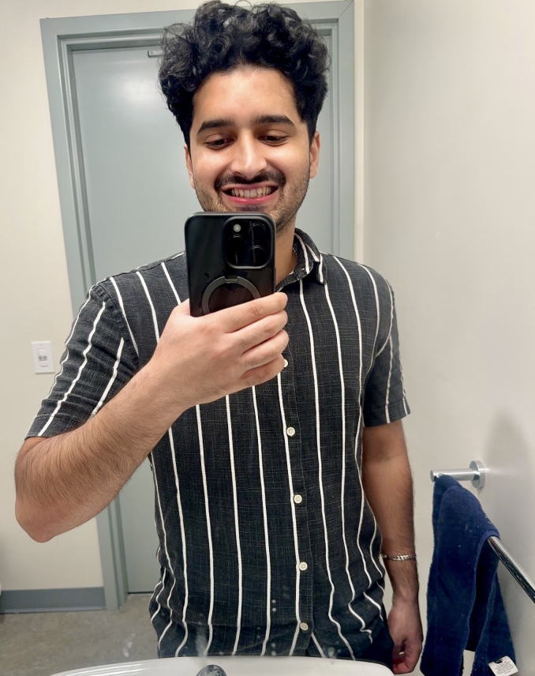

# Yusuf Damda

## About Me
Hi, I'm Yusuf. I am a CS student at UC San Diego interested in software engineering and building useful projects. I am originally from the San Fernando Valley and I transferred to UCSD Fall 2025. 

## As a Programmer
I have experience with **Java**, **C**, and **C++**, and I am currently learning Git, GitHub, and more Python.

## As a Person
Outside of programming, I enjoy lifting weights, self improving, and learning skills that help me grow.

## Picture

[View my image](image.png)

## Quote
> Better to try and fail than to not try at all.

## Code Example
```java
public class Hello {
    public static void main(String[] args) {
        System.out.println("Hello, GitHub!");
    }
}
```
## Lists

### Ordered List
1. Learn Git
2. Learn Markdown
3. Build projects

### Unordered List
- Java
- C++
- Python

## External Link
[Visit Youtube](https://youtube.com)

## Section Link
[Jump to Lists](#lists)

## Tasks
- [x] Setup Git
- [x] Learn Markdown
- [ ] Build projects

